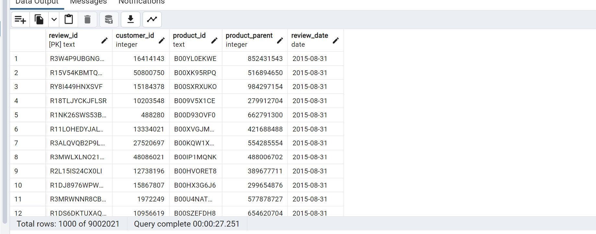
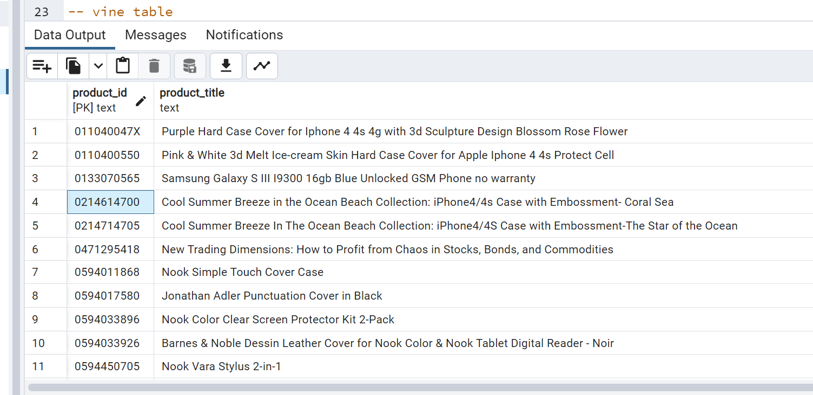
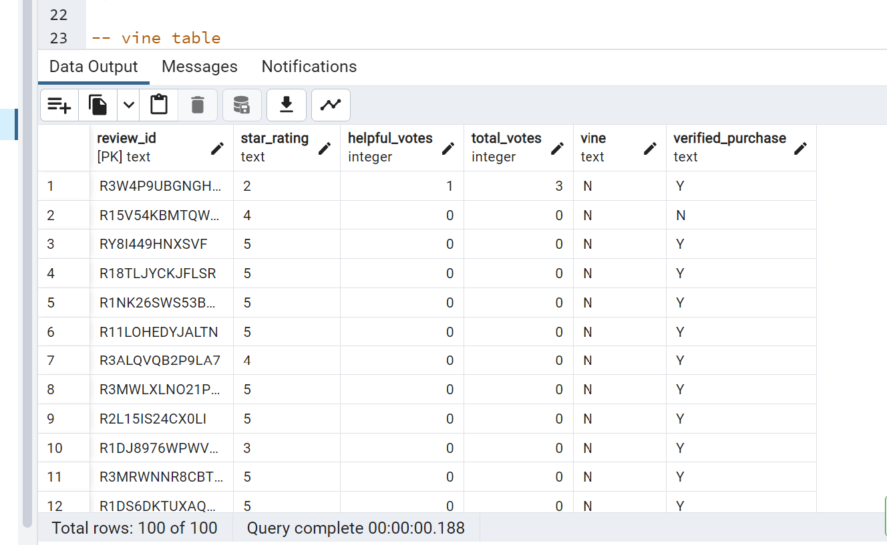
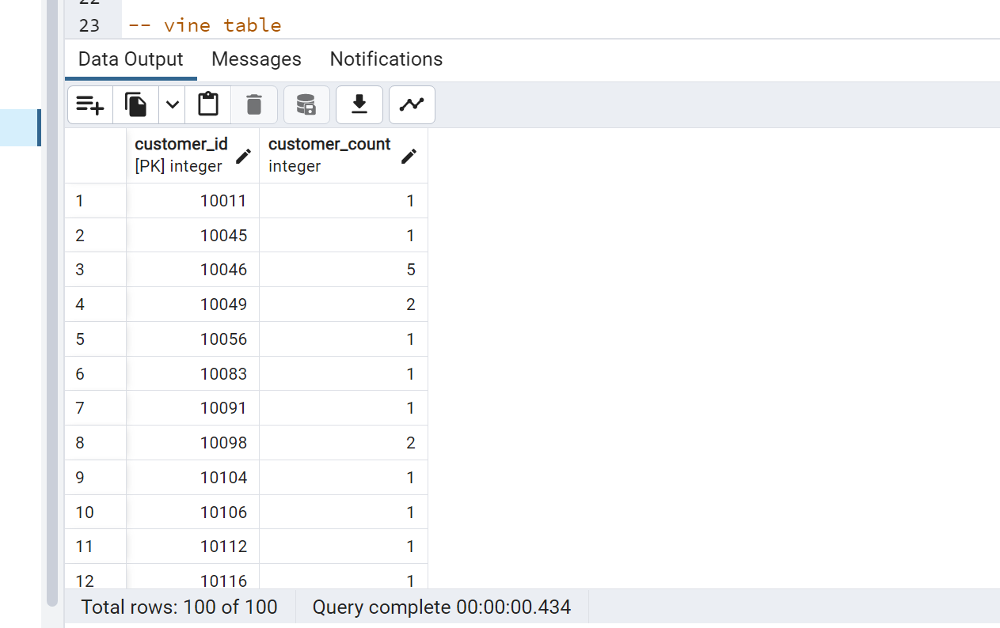

# Amazon_Vine_Analysis
ETL and AWS
# Overview Of The Analysis
### Purpose Of This Analysis 
* In this project, We have to access around 50 datasets. 
* Each one contains the different kind of data about the reviews on different products. 
* We have to pick one of them and use **Pyspark** to perform the **ETL process** to extract the dataset, transform the data, 
  connect to **AWS RDS instance** and load the transform data into **pgAdmin**.
* Next we used **PySpark,Pandas, or SQL** to determine if there is any bias towards favourable reviews from Vine Members 
  in our dataset.
### Amazon Review ETL(1st deliverable)
In this deliverable we pick one random dataset and creating four tables from four DataFrames.The each tables from different dataframes are bellow:
  * Review_id_table from review_df

  * Products_table from product_df
 
  * Vine_table from Vine_df
 
  * customers_table from customers_df
  
 
     
    
# Results
### How many Vine reviews and non-Vine reviews were there?

### How many Vine reviews were 5 stars? How many non-Vine reviews were 5 stars?

### What percentage of Vine reviews were 5 stars? What percentage of non-Vine reviews were 5 stars?

# Summary

Per the summary,
There is a total number of reviews of 65,581 Of this number,Paid vine star with a 5 star rating is 613, unpaid vine 5 star ratings is 64,968.Also, about 36.22% of reviewers constitute the paid vine category and 47.01% constitute the unpaid category. There is bias in my opinion since the paid and unpaid cocategories together constitutes more than 50% of the total 5 star vine reviewers. 
