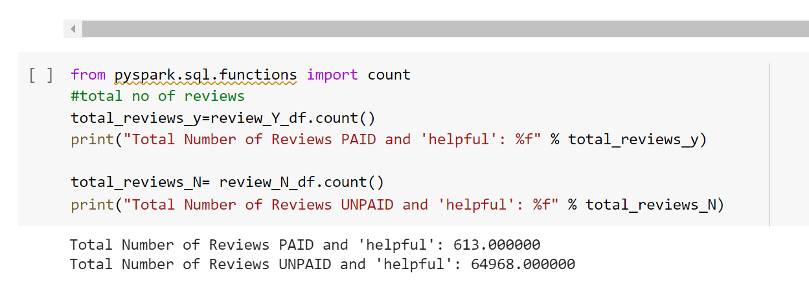
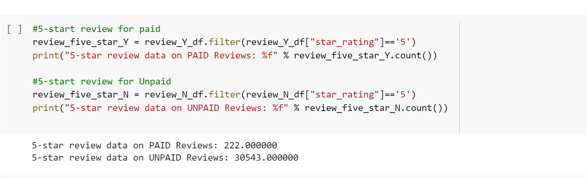
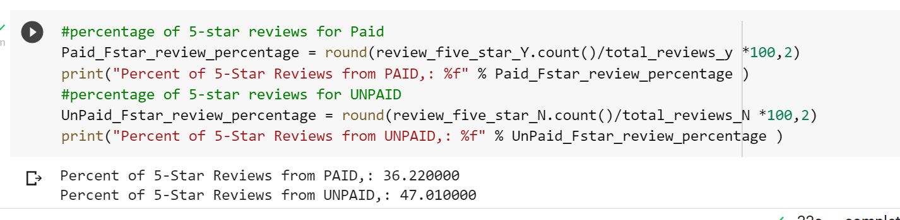

# Amazon_Vine_Analysis
ETL and AWS
# Overview Of The Analysis
### Purpose Of This Analysis 
* In this project, We have to access around 50 datasets. 
* Each one contains the different kind of data about the reviews on different products. 
* We have to pick one of them and use **Pyspark** to perform the **ETL process** to extract the dataset, transform the data, 
  connect to **AWS RDS instance** and load the transform data into **pgAdmin**.
* Next we used **PySpark,Pandas, or SQL** to determine if there is any bias towards favourable reviews from Vine Members 
  in our dataset.
### Amazon Review ETL(1st deliverable)
In this deliverable we pick one random dataset and creating four tables from four DataFrames.The each tables from different dataframes are bellow:

 
     
    
# Results
### How many Vine reviews and non-Vine reviews were there?

### How many Vine reviews were 5 stars? How many non-Vine reviews were 5 stars?

### What percentage of Vine reviews were 5 stars? What percentage of non-Vine reviews were 5 stars?

#Summary
